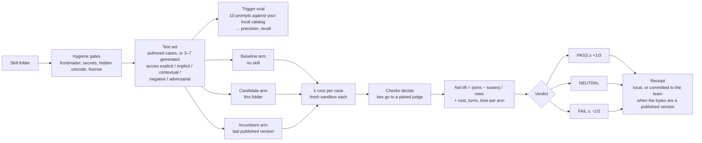

# terum-skills

**Evaluate and share Claude Code skills across your team. No server.**

[](https://www.npmjs.com/package/terum-skills)
[](https://github.com/ryanliu-terum/terum-skills/actions/workflows/ci.yml)
[](LICENSE)
[](https://discord.gg/SVVzejCf9)

<!-- HERO VIDEO: drag the .mp4 into a GitHub issue or PR comment, copy the
     github.com/user-attachments/assets/... URL it produces, and paste that URL
     on its own line here in place of the image below. GitHub renders it as an
     inline player. -->


## Install

```sh
npx -y terum-skills@latest setup
```

Requires Node 22.12+, `git`, and an authenticated GitHub CLI (`gh auth login`). Setup creates a team or joins one, then opens the desktop app. There is nothing to install: `npx -y` runs the latest release every time.

To join an existing team, a member invites you from the app's Share page with your GitHub username. GitHub emails you the repository invitation, and the app gives them a one-line join command to send you.

## Why I built this

I've been searching for best skills and practices for using the amazing AI tools we have today from Claude Code to Cursor. While searching for best practices, I ended up personally evaluating skills I found via social media like superpowers or Matt Pocock by creating my own test framework. Then, when I wanted to share them with my team, I found myself having to manually zip files, send them over from my global folder(which I didn't want to link to my team's shared repo). All of this took quite a while, so I made this project, and hope it saves some time for others.

**Core beliefs of the project:**

- **Skills are extremely impactful at increasing efficiency with AI.** [SkillsBench](https://arxiv.org/abs/2602.12670)
- **The most impactful skills only work in the context of the project they were created for.** 
- **It should be easy to evaluate the best skills that work for a project and easy to distribute them among the contributors of that project.** 

**Use cases:**

- Measure the ROI of skills and their workflows: cost, time, and quality of output.
- Compare similar skills against each other: your skill vs a public one, two public skills, or two versions of your own.
- Share skills with team members easily.

## Collaborate with us!

We're interested in collaborators, and just as much in feedback and the things you want us to add. Join our Discord to talk to us: [discord.gg/SVVzejCf9](https://discord.gg/SVVzejCf9)! Bugs and feature requests are also welcome as [GitHub issues](https://github.com/ryanliu-terum/terum-skills/issues), or just email ryanliu@terum.ai directly (I've offered your email as tribute Ryan).

## What you get

**Library: your local skills, as they are on disk.** Global skills and per-project skills, read straight from your folders. Each folder has a per-machine on/off switch, and when its bytes match a version the team has published, the card shows the team's eval for exactly those bytes.


**Marketplace: everything your team has published, with its score.** Publishing is explicit and creates an immutable version; identical bytes reuse the version and gain its evals. Installing copies a version from the team repo into a folder you choose.


**Evals: the skill against no skill, in fresh sandboxes.** Each case runs without the skill and with it, using your own Claude Code login. You get cost, time, and quality per run, and a PASS / NEUTRAL / FAIL verdict the whole team can see.


**Share: your team is a private GitHub repo.** Invite by GitHub handle. Members, skills, versions, and eval receipts are plain files in git, so nothing runs anywhere but laptops and the git host.


Two more things worth knowing:

- Setup also installs a `/terum-skills` skill for Claude Code, so Claude can run these commands for you inside a session.
- The desktop app is a window onto the CLI. Every verb works from the terminal without it.

## How evaluation works

A skill is a set of instructions and files that changes how a coding agent behaves. A good one makes the agent faster and safer; a bad one makes it worse. The trouble is that "it seemed to help" is exactly the kind of claim humans get wrong: agents are noisy, tasks vary, and a skill that shines on its author's machine can do nothing on yours.

So we treat skill evaluation the way medicine treats a new drug: with a control group, repeated trials, and a written record anyone can audit later. One command runs the whole study; one committed file preserves the result. The method follows [NVIDIA's SkillEvaluator](https://docs.nvidia.com/skills/skillevaluator) and [SkillsBench](https://arxiv.org/abs/2602.12670): deterministic hygiene gates first, then a measured lift of with-skill over without-skill on a fixed task set.



The question is never "what score did the skill get?" It's the only question that matters in practice: is the agent measurably better with this skill than without it, and better than the version we already had?

- **Cases** live in the skill folder and travel with it. A skill with none still gets evaluated: `eval` generates between three and seven, sized to the skill's complexity and spread across the five prompt buckets, plus five should-trigger and five should-not-trigger prompts. Every generated file is marked as generated.
- **Arms** run in fresh sandboxes through `claude -p`, with user-level skills excluded, and the engine refuses to run if the skill under test leaks into the baseline. Each case runs once by default; `--k 3` gives an estimate you can gate on.
- **Verdicts** come from the deterministic checks. Only a tie goes to a judge, which compares the two transcripts twice with the order reversed and must agree with itself, or the row stays a tie.
- **Receipts** record who ran it, the engine and Claude Code versions, the models resolved, `k`, and the cases. Results are only compared when those match.

<!-- TODO(docs): link the full method (hygiene checks, case and trigger file
     formats, run phases, judge escalation, receipts) once docs/ is written. -->

## FAQ

**Isn't it super easy to share skills by just pushing them to GitHub?**
Yes, it is, and you should do that if you only work on one project and don't mind having your `.claude` in your project. Three things it doesn't solve:

- **Placement.** You work on multiple projects with specialized skills, the repo can't carry a `.claude` (open source, enterprise), or you want global and project skills kept separate yet still shared.
- **Visibility.** A skill in the repo is not a skill in use. Manually triggered skills only get used by people who were told they exist and shown how to call them. Terum shows every teammate what is published, what it scored, and who installed it.
- **Bloat.** More skills is not better. Every installed skill's description sits in the agent's context on every turn, and [SkillsBench](https://arxiv.org/abs/2602.12670) found that tasks paired with four or more skills gained about half of what one to three did. Longer context also degrades output on its own ([Chroma's context rot study](https://research.trychroma.com/context-rot)). Evals tell you which skills to keep, and the per-machine switch turns off the rest.

**Aren't there open source frameworks for evaluating skills already?**
Yes! [NVIDIA's SkillEvaluator](https://docs.nvidia.com/skills/skillevaluator) and the [SkillsBench](https://arxiv.org/abs/2602.12670) paper, and our method is heavily based on both. Terum doesn't reinvent the wheel; it makes those methods plug and play. SkillEvaluator requires Docker and an API key; SkillsBench requires you to bring your own tests. Terum runs on your subscription plan, from one terminal command, with tests generated for the specific skill under test.

**Does any private information, skill usage, or metadata get out?**
No. Fully open source, locally hosted. All skill data is yours and your team's. We're working on a fully open skill marketplace, like skills.sh but with skills ranked by effectiveness rather than downloads.

## CLI

Every verb runs as `npx -y terum-skills@latest <verb>`. The ones you'll type by hand:

| Command | What it does |
| --- | --- |
| `setup [<org>/<repo>]` | Create or join a team, then open the app |
| `app` | Install and open the desktop app for this CLI version |
| `publish <skill>` | Publish a local folder as an immutable version, or attach new evals to an identical one |
| `install <skill>` | Copy a team skill into your global or a project folder |
| `eval <skill>` | Evaluate a local skill with your own Claude Code login |
| `sync` | Fetch the team repo; never touches your local skills |

<details>
<summary>All commands</summary>

| Area | Commands |
| --- | --- |
| Team | `setup [<org>/<repo>]` · `login` · `status` · `invite <github-login>…` · `profile` · `team create [name]` · `team join <target>` · `team leave <name>` · `team move <target>` · `team remove <handle>` · `team migrate` · `team workflow-update` · `team project create [name]` · `team project delete [name]` |
| Library | `ls` · `ls member <handle>` · `ls project <name>` · `search <term>` · `project add [path]` · `project remove <path>` · `project list` · `reconcile` · `skill move <path>` · `skill copy <path>` · `skill rename <path>` · `skill delete <path>` · `skill fix <path>` · `skill category <path>` · `skill enable <path>` · `skill disable <path>` · `prune` |
| Sharing | `publish <ref>` · `unpublish <skill>` · `install <ref>` · `uninstall-skill <ref>` · `sync` |
| Evals | `validate <path\|name>` · `eval <skill…>` · `eval-report <skill>` · `usage [skill]` |
| Machine | `app` · `app-update` · `update` · `uninstall` · `serve` |

</details>

`npx -y terum-skills@latest --help` lists every verb, and `<verb> --help` its options. Programs drive the CLI with `--frames`, one JSON object per line; see [docs/frame-protocol.md](docs/frame-protocol.md).

## Updating and uninstalling

Updates are automatic. The CLI runs the latest release every time through `npx -y`, and the desktop app downloads its own new version and installs it when you quit, overnight, or when you press Install now, whichever you chose in Settings ▸ Updates. `npx -y terum-skills@latest uninstall` removes your team from this machine, the session hook, the Claude Code skill, and the app bundle, and keeps your quarantine, backups, and local eval runs.

## License

Apache-2.0. `NOTICE` credits the skillhub modules the placer derives from.
