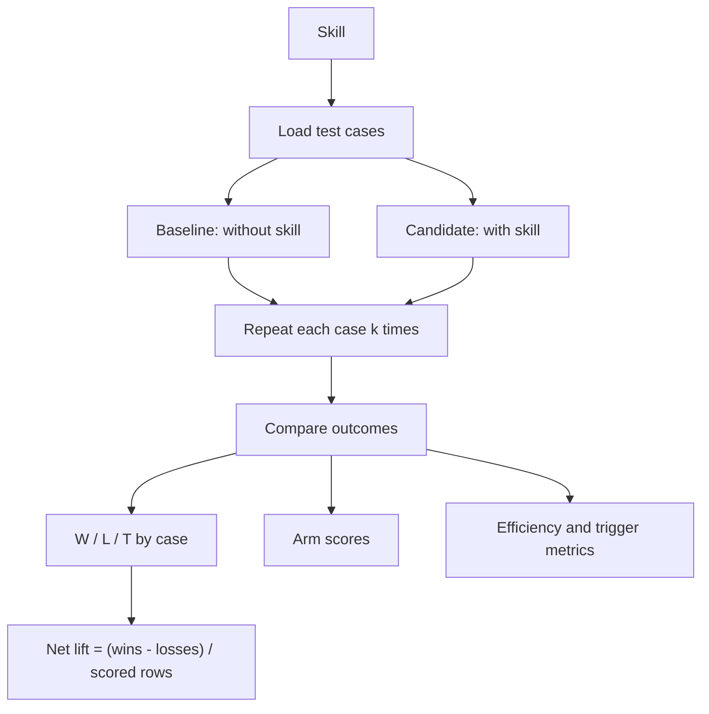

# terum-skills(Evaluating the best skills and sharing them)

I've been searching for best skills and practices for using the amazing AI tools we have today from Claude Code to Cursor. While searching for best practices, I ended up personally evaluating skills I found via social media like superpowers or Matt Pocock by creating my own test framework. Then, when I wanted to share them with my team, I found myself having to manually zip files, send them over from my global folder(which I didn't want to link to my team's shared repo). All of this took quite a while, so I made this project, and hope it saves some time for others. 

## Quick start
**Core beliefs of the project:**

- Skills are extremely impactful at increasing efficiency with AI.
- The most impactful skills only work in the context of the project they were created for
- It should be easy to evaluate the best skills that work for a project and easy to distribute them among the contributors of that project.

As a result, we built Terum, a free, fully open source tool that lets you evaluate and share the best skills/workflows among a team! Two line terminal installation that installs a CLI package and a lightweight application for a simple UI that wraps the CLI. Fully self-hosted, no server, all skills live in a private GitHub repository that the CLI package calls from. 

Our purpose is it make it quick and easy to determine best AI practices through skills and share your findings with your team. 

## Why should I use this? Who would find this helpful?

**Who would find this helpful?**
- **Developers in an team** looking to discover and share best practices internally
- Individuals looking to evaluate the near infinite amount of publicly available skills and decide which ones are best for their own repo.


**Isn't it super easy to share skills by just pushing them to GitHub? **
- **Yes, it is**, and you should do that if you only work on one project and don't mind having your .claude in your project.
- However, if any of the following apply, Terum might be useful:
  - If you're working on multiple projects with specialized skills,
  - If the repo does not allow .claude in the repo itself(open source, enterprise projects),
  - If you're trying to manage and separate global and project skills while still sharing them easily with teammates 


**Aren't there open source frameworks for evaluating skills already? **
- **Yes, there are!** Like Nvidia's SkillEvaluator or the SkillsBench paper. Our evaluation methods are heavily based off of these proven methods. Terum doesn't try to reinvent the wheel, it just adopts the methods so that they are fully plug and play. SkillEvaluator requires Docker and an API key; SkillsBench requires you to bring your own tests. Terum runs using your subscription plan, with one terminal installation, using dynamically generated tests for the specific skill being tested(we're currently looking into dynamic generation along with category-specific tests). 

**How are you evaluating skills?**
- Answered above. For more specific notes on methodology, scroll to the bottom. 


**Does any private information including skill usage, metadata, or information get out?**
- **Nope!** Fully open source, locally hosted. All skill data is yours and your team's. We're working on a fully open skill marketplace(like skills.sh but with skills ranked by effectiveness, not downloads)


## Quick start

Requires Node 22.12+, `git`, and an authenticated GitHub CLI (`gh auth login`).

```sh
npx -y terum-skills@latest setup
npx -y terum-skills@latest app
```
The default setup command will lead you towards creating a team. To join a team, ask the owner of a team to use `npx -y terum-skills@latest invite <your github username>`. They will receive a command that you can paste into your terminal. Or, if you know the organization name and repo name and have already been invited, you can run:

```sh
npx -y terum-skills@latest setup <org name>/<repo name>
npx -y terum-skills@latest app
```

There is no install step — `npx -y` fetches and runs the latest release every time. (Prefer a permanent `terum-skills` binary? See [Installing, updating, uninstalling](#installing-updating-uninstalling).)

Setup also offers the `/terum-skills` Claude Code skill, placed at `~/.claude/skills/terum-skills/`, so Claude Code can run these commands for you inside a session (and hand you the ones that need a terminal). It ships inside the npm package; re-running `npx -y terum-skills@latest setup` after an update refreshes it.

## How it works

**Your library are your local folders.** Kind of just like a file explorer but just explicitly for your own skills. This is a direct mirror of your own local system. 

**Local-first, with shared skills in a team Github, created on setup** The team repo holds every skill and their unique versions in GitHub along with each skill's associated eval. Each individual has their own .json detailing their personal profile along with the skills they have published or have installed. 

**Sharing skills with a team** To share a skill with a team, you must explicitly publish the skill. If no skill already exists in the shared repo with the same name, creates a Version 1 of that skill as you shared it. Team members get the shared skill on the next git pull from the remote repo(every 1hr, can manually sync on demand). If a skill with the same name already exists, check if any of the versions are identical to the version you are trying to publish. If identical, attach any new local evals you have ran associated with that version to the shared repo. If not identical, create a new version of that skill by incrementally increasing the version number. 

**The team marketplace holds your teams shared skills** Marketplace shows you all of the published skills by your team members along with their evals

**Installation of a team's skill** Installing copies the skill from your local clone of the shared team repo into the folder you select. Uninstall removes the copy of that skill from the folder. 

**Nothing runs anywhere but laptops and the git host.** No HTTP client, no daemon, no API key. The CLI talks to git and, for GitHub teams, to `gh`.

## Evaluating skills
A skill is a set of instructions and files that changes how a coding agent behaves. A good one makes the agent faster and safer; a bad one quietly makes it worse. The trouble is that "it seemed to help" is exactly the kind of claim humans get wrong — agents are noisy, tasks vary, and a skill that shines on its author's machine can do nothing on yours.

So we treat skill evaluation the way medicine treats a new drug: with a control group, repeated trials, and a written record anyone can audit later. One command runs the whole study; one committed file preserves the result.

### How an evaluation works
An eval starts with a skill and a set of task cases. Each case runs repeatedly in fresh sandboxes, both without the skill and with it. The results are compared using checks, transcript judging when needed, and a small set of supporting metrics.

The question is never "what score did the skill get?" It's the only question that matters in practice: is the agent measurably better with this skill than without it — and better than the version we already had?



By default, each case runs once. Use `--k 3` when you need a more stable estimate.

### Two layers
Evaluation has two parts: hygiene and execution.

#### Hygiene
Hygiene checks are deterministic and free. They run before skill content reaches the repository through `validate`, `connect`, `sync`, `publish`, `eval`, or team CI.

\| Code | Fails when |

\| --- | --- |

\| `HYG1` | Frontmatter does not parse, the folder name differs from `name`, or `allowed-tools` grants are malformed. |

\| `HYG2` | A text file contains bidirectional or zero-width characters, or a token mixes scripts in a way that resembles a homoglyph attack. |

\| `HYG3` | A file contains a credential pattern or an email address other than the author's own. |

\| `HYG4` | A file has an executable bit or shebang without `--allow-privileged` consent, or uses an extension outside the allowlist. |

\| `HYG5` | The frontmatter license, team policy license, and any bundled `LICENSE` file disagree. |

\| `HYG6` | `description` is empty. A `SKILL.md` longer than 20,000 characters produces a warning but does not block. |

#### Execution
`eval` runs the skill through your logged-in Claude Code CLI. Each arm gets a fresh throwaway sandbox. The command reads the team clone and writes only to its local run directory, plus a receipt when you pass `--commit`. It does not modify `skills/`, `people/`, or installed copies of a skill.

### Writing evals
Eval files live inside the skill folder and travel with the skill.

#### Execution cases
Put one case in each file under:

```text

skills/<name>/evals/cases/<case>.yaml

```

Example:

```yaml

task: "Add a preflight check before deploy.sh runs and explain what it verifies."

files:

  deploy.sh: |-

    #!/bin/sh

    echo deploying

setup: "git init -q"

requires: ["python3"]

checks:

  - file_exists: "preflight.sh"

  - no_command_matching: "deploy\\\\.sh"

  - command_succeeds: "sh -n preflight.sh"

judge: "Prefer the transcript that names the concrete failure modes the preflight guards against."

```

`files` seeds the sandbox, `setup` runs once with a 60-second limit, and `requires` lists host tools the case needs. If a required tool is missing, the case is visibly skipped.

The six supported check types are:

- `transcript_mentions`

- `command_matching`

- `no_command_matching`

- `file_exists`

- `file_absent`

- `command_succeeds`

All checks for an arm must pass for that arm to pass the case. Write tasks that a headless agent can complete without asking questions. Describe conventions as normal working practices instead of hiding magic strings in the prompt; an agent that stops to ask for clarification fails the case.

The optional `judge` is only used when the checks tie.

#### Trigger cases
Use `skills/<name>/evals/triggers.yaml` to test whether the skill is selected at the right time:

```yaml

should_trigger:

  - "prompts that must select this skill"

should_not_trigger:

  - "near-miss prompts that should select a sibling skill or no skill"

```

Good negative examples are near misses. Unrelated prompts provide little useful signal.

### Generated evals
You can evaluate a skill even when it does not include eval files. By default, `eval` generates whatever is missing. Authored assets always take priority:

- if execution cases exist, none are generated;

- if cases exist but `triggers.yaml` does not, only trigger prompts are generated; and

- if neither exists, generation creates three execution cases, including at least one adversarial case, plus five positive and five negative trigger prompts.

Generation reads the complete skill and the team catalog. Negative trigger prompts are based on nearby sibling skills, so they test realistic confusion rather than random unrelated requests.

Every generated file is checked against the real case or trigger schema before it is used. Generated cases may use the five declarative checks, but not `command_succeeds`; this prevents the generator from inventing an incorrect verification program. If the files are still invalid after two correction attempts, the eval stops with an error.

Generated files begin with:

```text

## generated by terum-skills eval-gen — review before trusting
```

The header also records the model and generation time.


### What happens during a run
#### 1. Preflight
The runner records `claude --version` and sends a one-turn smoke task. A logged-out or broken CLI therefore fails before the full set of paid trials begins.

#### 2. Trigger evaluation
The selection catalog contains the team's endorsed skills plus the candidate skill. For each trigger prompt, a tool-free one-turn call chooses which skills apply. The report shows recall, precision, and every `MISS` or `FALSE-FIRE`.

#### 3. Execution arms
Each case runs in three arms, with `k` repetitions per arm:

\| Arm | What it contains |

\| --- | --- |

\| Baseline | No copy of the skill under test. |

\| Candidate | The version currently being evaluated. |

\| Incumbent | The latest version with a committed receipt. This shows whether a republish improves on what it would replace. |

Every repetition runs `claude -p` in a fresh sandbox with `--setting-sources project`, preventing user-level skills from leaking into the run. The engine checks the resolved skill list and refuses to continue if the tested skill appears in baseline or is missing from candidate.

#### 4. Row verdicts
Each candidate-baseline row is decided in this order:

1\. If both arms fail, the row is a tie.

2\. If only one arm fails, the other wins.

3\. If their checks differ, the checks decide the row.

4\. If the checks tie and the case has a `judge`, a pairwise judge compares the transcripts twice, reversing the A/B order on the second pass.

Both judge passes must agree. Otherwise, the row is a tie marked `judge-split`.

If a judge response cannot be parsed, it is retried once. A second parse failure is sent to a stronger model—`opus` by default. If that response is also invalid or refuses the task, the result is a labelled tie. The runner never turns an unclear judgment into a win.

Every row records how it was decided.

#### 5. Headline and supporting metrics
Candidate lift over baseline is:

```text

(wins - losses) / scored rows

```

The result is grouped into three bands:

\| Verdict | Net lift |

\| --- | ---: |

\| `PASS` | At least `+1/3` |

\| `NEUTRAL` | Between `-1/3` and `+1/3` |

\| `FAIL` | At most `-1/3` |

The report also includes:

- ****arm score:**** checks passed divided by total checks for each arm;

- ****efficiency:**** turns, elapsed time, and cost per arm; and

- ****trigger quality:**** precision and recall.


### Receipts
`eval --commit` writes one immutable receipt to:

```text

evals/<skill-id>/<tree-hash>/<run-id>.json

```

The tree hash pins the exact bytes that were evaluated. Running the same version again adds another receipt beside the earlier one; receipts are never overwritten or deleted.

Anyone can evaluate any team member's skill. A receipt records:

- who ran the eval;

- the engine and Claude Code versions;

- the models that were actually resolved;

- the repetition count `k`; and

- the cases included in the run.

Results are only compared when their model and Claude Code versions match.

`--working` evaluates your connected local source instead of the stored copy. It cannot be combined with `--commit`, because receipts only pin committed trees.

### Where the design comes from
The framework's measurement discipline comes from [NVIDIA's SkillEvaluator](https://docs.nvidia.com/skills/skillevaluator). We didn't adopt it on reputation: we ran it end-to-end on our own skills first, and kept what survived that trial. The adoptions fall into three groups.

****Hygiene gates.**** The free deterministic tier is theirs in structure and substance: metadata schema validation, a scan for personal data, a security review of every bundled script, detection of hidden Unicode characters that could smuggle instructions past a human reader, and license reconciliation that fails closed when a skill's declared license conflicts with its LICENSE file. So is mandatory secret redaction of anything that crosses the sharing boundary — the rule the privacy note above enforces.

****Measurement design.**** Their four-bucket taxonomy for trigger prompts — explicit, implicit, contextual, and negative near-misses — is the structure every authored test set follows. The efficiency dimension comes straight from their insistence that a skill that wins but triples token burn has to say so. Verdict banding with a neutral dead-zone follows their asymmetric threshold pattern — a modest positive bar to pass, a stricter negative bar to fail — applied here to net lift. And contamination control is their rule verbatim: the arm under test contains exactly the skill under test, and the engine refuses to run if a stray global copy of that skill would silently zero out the measured lift.

****Operational robustness.**** Before any paid matrix runs, a runtime preflight performs one tiny real agent task — their preflight caught, in seconds, an infrastructure failure that would otherwise have burned six paid trials. Every result records its attempt policy and a digest of the exact test set that produced it, so no receipt can drift from its inputs. Partial results are labeled, never averaged into a clean-looking number. And the judge escalation chain — format-tolerant parsing, then retry, then a stronger judge model — exists because we watched a cheap judge fail deterministically on a single hard case.

****What we deliberately left behind.**** SkillEvaluator's live-execution tier requires containers and a raw API key — an onboarding tax we measured firsthand, and one that shuts out subscription-authenticated agents entirely. We also passed on its agent-agnostic harness, its embedding-based deduplication tier, its cloud sandbox backends, and its five-dimension 0-to-1 rubric as the headline score: at the sample sizes a team can actually afford, a win/loss record summarized as net lift is the more honest instrument.

The execution engine itself is our own: a three-arm, comparison-first harness that drives each member's own logged-in agent instead of containers or cloud sandboxes, plus the trigger evals measured against the team's real catalog, the incumbent regression arm, the committed receipt system, and the display rules above. SkillEvaluator supplied the discipline; our own measurements supplied every departure from it.

### Why it's built this way
Every rule above traces back to something we measured rather than assumed: that real execution is non-negotiable, that repetition is the price of a trustworthy verdict, that arm scores are stable where their differences are not, and that honest small-sample statistics mean saying "neutral" far more often than a marketing page would like. The framework's job is not to make skills look good. It's to make one command produce a verdict a teammate can commit, audit, and believe.

## Installing, updating, uninstalling

- **Default (no install):** every documented command runs as `npx -y terum-skills@latest <verb>`. npx fetches the newest release on each run, so there is nothing to install, update, or add to PATH. The forms below are optional alternatives that give you a bare `terum-skills` binary.
- **Update:** `npx -y terum-skills@latest update` prints this copy's version, the newest advertised release, and the exact command that updates *this* copy. It never runs a package manager. `npx -y terum-skills@latest` fetches the newest release every run and updates nothing else.
- **Uninstall:** `npx -y terum-skills@latest uninstall` removes your team from this machine (placed skills, clone, cache), the session-start hook, the `/terum-skills` Claude Code skill it placed, and `~/.terum/skills` except its recovery data (`quarantine/`, `backups/`) and local eval runs (`evals/`); it also removes the downloaded desktop app bundle (`app/`), then prints the one package-manager line to finish. `uninstall-skill <skill>` removes one skill.

Release notices appear last on stderr, at most once per release per day, and are suppressed in CI, when stderr is piped, or when `NO_UPDATE_NOTIFIER` or `TERUM_SKILLS_NO_UPDATE_NOTIFIER` is set. Version checks read git tags from this repository only, never the npm registry, and only when a configured team is on GitHub.

## Troubleshooting

- email ryanliu@terum.ai directly for bugs/feature requests, we'll get back to you within 12 hours.


## CLI Commands(assuming not using the app)

| Group | Command | What it does |
|---|---|---|
| Team | `setup [<org>/<repo>]` | Create-or-join wizard; sequences the verbs below, then offers the session hook and the `/terum-skills` Claude Code skill |
| | `login` | Check `gh` and record your name, email, and handle |
| | `team create` / `team join` / `team leave` / `team remove <handle>` | Manage the repo and its roster |
| | `invite <github-user>…` | Grant repo access and print the join line |
| | `ls [--local]` / `ls member <handle>` / `ls project <name>` / `status` / `search <term>` | Read the team, your local skills, or the catalog |
| | `checkout add [<path>]` / `checkout remove <path>` / `checkout list` | Register, forget, or list the checkout folders this machine scans (`ls --local` also shows the current repository, labelled not registered) |
| | `checkout discover [--under <dir>…] [--depth <n>] [--budget-ms <n>] [--register]` | Find local folders holding `.claude/skills`; optionally register them. Setup offers this search and opt-in evaluation of shared skills with no current receipt (`--no-discover` / `--no-evals` skip the offers) |
| | `team workflow-update` | Print the current team workflow scaffold with `--print` for manual migration |
| | `project create [<name>] [--remote <url>]` | Create a team project: a name and the repository its skills place into (the skills themselves are added with `publish --project`) |
| | `profile [--name <display>] [--bio <text>] [--role <role>] [--project <name>]…` / `decline <ref>` | Describe yourself in your own people file (job label, projects) / record a shared skill you decline |
| Skills | `connect [<path>]` | Put a local skill folder in the team repo and keep your later edits synced |
| | `install <ref> [--into global\|<checkout root>]` / `uninstall-skill <ref> [--from global\|<checkout root>]` | Place or remove a skill (`member <handle>` and `project <name>` install whole lists); `uninstall-skill` asks once, listing every folder it will remove |
| | `sync` | Pull, finish pending installs, mirror connected edits, refresh placed copies; `--auto` runs without prompts, `--fresh-ms <n>` sets its freshness window |
| | `refresh` | Fetch the team clone to `origin/main` and nothing else — no placement, no sharing, no stamp; the desktop app runs it in the background so a teammate's committed work becomes visible |
| | `serve` | Answer read requests on one long-lived process instead of starting a new one per call (`--frames` only; the desktop app drives it). Reads only: `status`, `ls`, `eval-report`, `search`, `validate`, `update` |
| | `publish <skill>` | Endorse a skill for the team: a PR (default policy) or a direct commit |
| Evals | `validate <path\|name>` | Deterministic safety and formatting checks, no model |
| | `eval <skill>` | Run the skill's evals on your own Claude Code login; `--commit` files a receipt. `eval --drain [--parallel n] [--window overnight] [--max n]` runs queued evals; `eval --queue-list` lists them; `eval --dequeue <team>/<skill>` removes queued versions |
| | `eval-report <skill>` | Show a skill's committed eval receipts and this machine's local runs (read-only, no fetch); the desktop app's Evals tab reads it |
| Machine | `update` / `uninstall` | Show the update command for this copy / remove everything from this machine |
| | `app` | Install and open the desktop app for this CLI version |
| | `app-update [--check\|--stage\|--apply] [--release <version>] [--reason on-close\|overnight\|manual]` | Check for, download, or install a newer desktop app; Settings ▸ Updates offers Install now, When I quit, or Overnight (01:00–05:00 after 30 idle minutes) |

`npx -y terum-skills@latest --help` and `npx -y terum-skills@latest <verb> --help` list every option you are expected to use.

For a program driving the CLI (the desktop app, a script), `--frames` turns any verb into one JSON object per line on stdout and stdin, questions included. See [docs/frame-protocol.md](docs/frame-protocol.md).

## License

Apache-2.0. `NOTICE` credits the skillhub modules the placer derives from.
