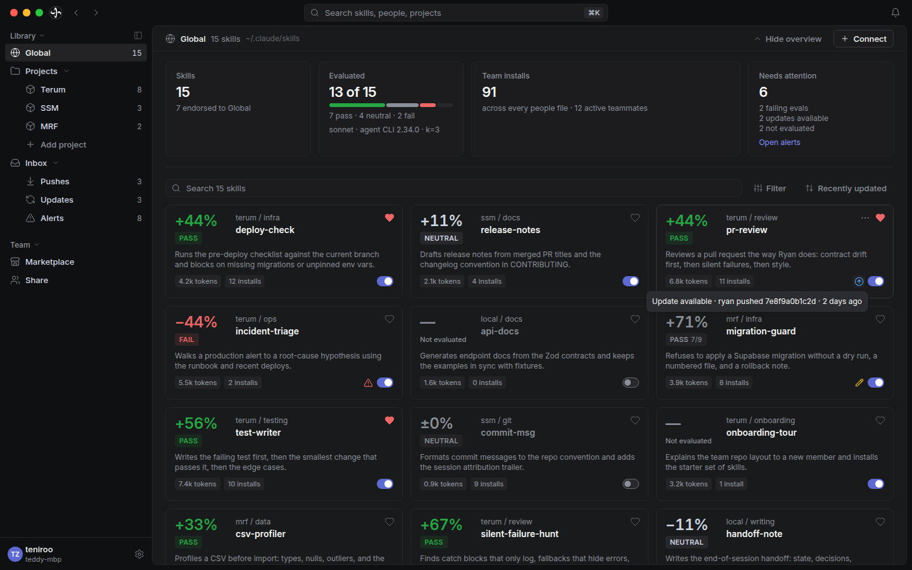
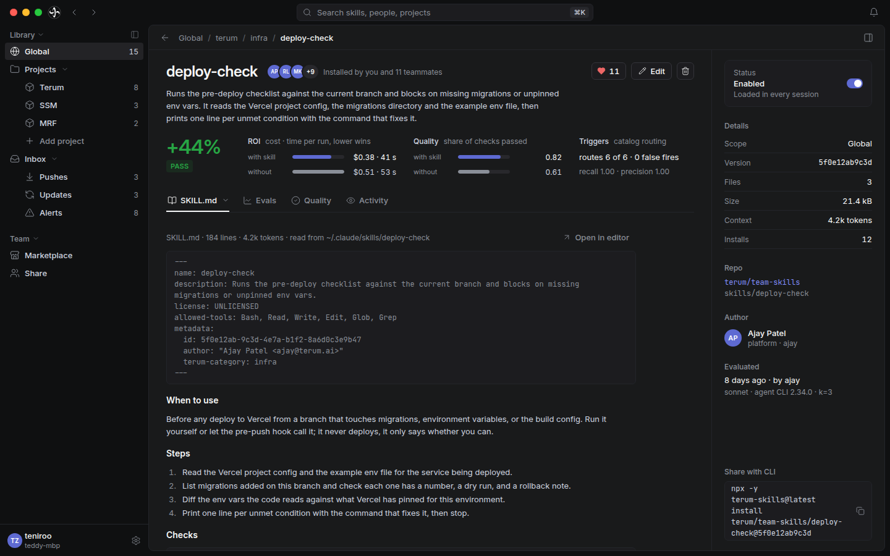
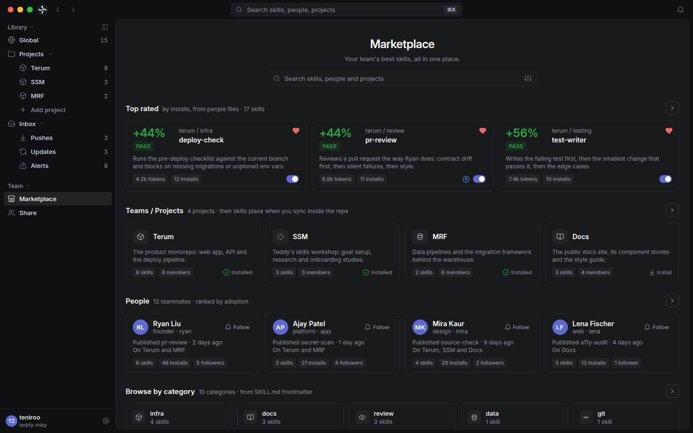
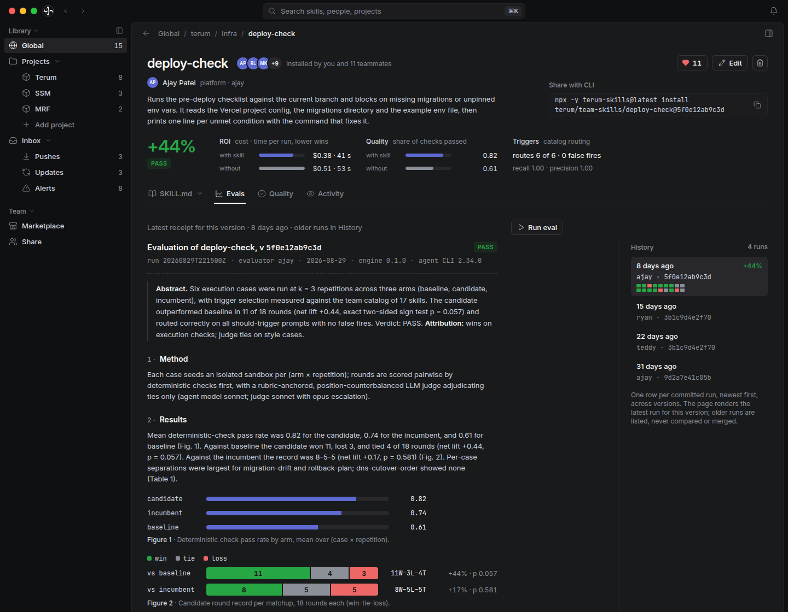
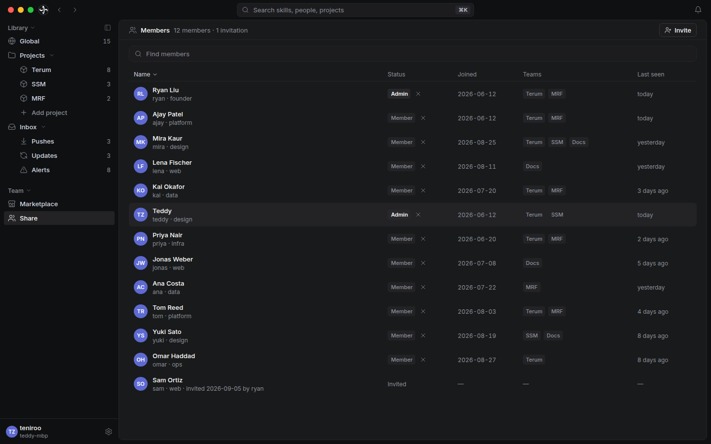
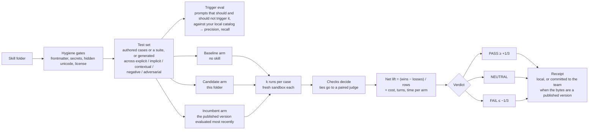

# terum-skills

**Evaluate and share Claude Code skills across your team. No server.**

[](https://www.npmjs.com/package/terum-skills)
[](https://github.com/ryanliu-terum/terum-skills/actions/workflows/ci.yml)
[](LICENSE)
[](https://discord.gg/SVVzejCf9)

[Docs](docs/README.md) · [Roadmap](docs/roadmap.md) · [Changelog](CHANGELOG.md)

<!-- HERO VIDEO: drag the .mp4 into a GitHub issue or PR comment, copy the
     github.com/user-attachments/assets/... URL it produces, and paste that URL
     on its own line here in place of the image below. GitHub renders it as an
     inline player. -->


## Install

```sh
npx -y terum-skills@latest setup
```

Requires Node 22.12+ and `git`. Creating a team on GitHub, inviting people, and downloading the desktop app also need the GitHub CLI logged in (`gh auth login`); joining a team does not. On macOS and Windows, setup installs and opens the desktop app first and the rest continues there; if the app cannot be installed at that point (gh logged out, offline), setup finishes in the terminal and tries the app once more at the end. On Linux and WSL there is no app yet, so setup runs in the terminal. `npx -y` runs the latest CLI release every time.

To join an existing team, a repository admin invites you from the app's Members page (or with `invite <github-login>`) using your GitHub username. GitHub emails you the invitation, and the app gives them the one-line join command to send you: `npx -y terum-skills@latest setup <org>/<repo>`.

## Why I built this

I've been searching for best skills and practices for using the amazing AI tools we have today from Claude Code to Cursor. While searching for best practices, I ended up personally evaluating skills I found via social media like superpowers or Matt Pocock by creating my own test framework. Then, when I wanted to share them with my team, I found myself having to manually zip files, send them over from my global folder(which I didn't want to link to my team's shared repo). All of this took quite a while, so I made this project, and hope it saves some time for others.

**Core beliefs of the project:**

- **Skills are extremely impactful at increasing efficiency with AI.** [SkillsBench](https://arxiv.org/abs/2602.12670)
- **The most impactful skills only work in the context of the project they were created for.** 
- **It should be easy to evaluate the best skills that work for a project and easy to distribute them among the contributors of that project.** 

**Use cases:**

- Measure the ROI of skills and their workflows: cost, time, and quality of output.
- Compare similar skills against each other: your skill vs a public one, two public skills, or two versions of your own.
- Share skills with team members easily.

## Collaborate with us!

We're interested in collaborators, and just as much in feedback and the things you want us to add. Join our Discord to talk to us: [discord.gg/SVVzejCf9](https://discord.gg/SVVzejCf9)! Bugs and feature requests are also welcome as [GitHub issues](https://github.com/ryanliu-terum/terum-skills/issues), or just email ryanliu@terum.ai directly (I've offered your email as tribute Ryan).

## What you get

**Library: your local skills, as they are on disk.** Global skills and the skills of projects you add, read straight from your folders. Each folder has a per-machine on/off switch, and when its bytes match a version the team has published, the card shows the team's eval for exactly those bytes.



**Marketplace: everything your team has published, with its score.** Publishing is explicit and creates an immutable version; identical bytes reuse the version and gain its evals. Installing copies a version from the team repo into Global or into a project you added.



**Evals: the skill against no skill, in fresh sandboxes.** Each case runs without the skill and with it, using your own Claude Code login. You get cost, time, and quality per run, and a PASS / NEUTRAL / FAIL verdict the whole team can see.



**Share: your team is a private git repo.** GitHub by default, any git host if you prefer. Invite by GitHub handle. Members, skills, versions, and eval receipts are plain files in git; nothing runs on a server of ours.



Two more things worth knowing:

- Setup offers eight skills for Claude Code and Codex (`list-skills`, `skill-info`, `search-skills`, `eval`, `eval-report`, `skill-status`, `sync-skills`, and `terum-skills` for any other verb), so either assistant can run these commands for you inside a session and show the result as a board, and a session-start hook that keeps the team repo fetched.
- The desktop app is a window onto the CLI. Every verb works from the terminal without it.

## How evaluation works

A skill is a set of instructions and files that changes how a coding agent behaves. A good one makes the agent faster and safer; a bad one makes it worse. The trouble is that "it seemed to help" is exactly the kind of claim humans get wrong: agents are noisy, tasks vary, and a skill that shines on its author's machine can do nothing on yours.

So we treat skill evaluation the way medicine treats a new drug: with a control group, repeated trials, and a written record anyone can audit later. One command runs the whole study; one committed file preserves the result. The method follows [NVIDIA's SkillEvaluator](https://docs.nvidia.com/skills/skillevaluator) and [SkillsBench](https://arxiv.org/abs/2602.12670): deterministic hygiene gates first, then a measured lift of with-skill over without-skill on a fixed task set.



The question is never "what score did the skill get?" It's the only question that matters in practice: is the agent measurably better with this skill than without it, and better than the version we already had?

- **Cases** live in the skill folder and travel with it. A skill with none still gets evaluated: `eval` generates either one suite or between three and seven cases, sized to the skill's complexity, plus five should-trigger and five should-not-trigger prompts. Every generated file is marked as generated.
- **Arms** run in fresh sandboxes through `claude -p` with your user-level settings and hooks left out, and the engine refuses to run if the skill under test leaks into the baseline. Each case runs once by default; `--k 3` gives an estimate you can gate on.
- **Verdicts** come from the deterministic checks. Only a tie goes to a judge, which compares the two transcripts twice with the order reversed and must agree with itself, or the row stays a tie.
- **Receipts** record who ran it, the engine and Claude Code versions, the models requested, `k`, and the cases. A card shows one receipt's own result with that provenance beside it; scores are never averaged across receipts.

The full method, the case and trigger file formats, the run phases, the judge rules and the receipt are in [Evaluating skills](docs/evaluating/overview.md).

## FAQ

**Isn't it super easy to share skills by just pushing them to GitHub?**
Yes, it is, and you should do that if you only work on one project and don't mind having your `.claude` in your project. Three things it doesn't solve:

- **Placement.** You work on multiple projects with specialized skills, the repo can't carry a `.claude` (open source, enterprise), or you want global and project skills kept separate yet still shared.
- **Visibility.** A skill in the repo is not a skill in use. Manually triggered skills only get used by people who were told they exist and shown how to call them. Terum shows every teammate what is published, what it scored, and who installed it.
- **Bloat.** More skills is not better. Every installed skill's description sits in the agent's context on every turn, and [SkillsBench](https://arxiv.org/abs/2602.12670) found that tasks paired with four or more skills gained about half of what one to three did. Longer context also degrades output on its own ([Chroma's context rot study](https://research.trychroma.com/context-rot)). Evals tell you which skills to keep, and the per-machine switch turns off the rest.

**Aren't there open source frameworks for evaluating skills already?**
Yes! [NVIDIA's SkillEvaluator](https://docs.nvidia.com/skills/skillevaluator) and the [SkillsBench](https://arxiv.org/abs/2602.12670) paper, and our method is heavily based on both. Terum doesn't reinvent the wheel; it makes those methods plug and play. SkillEvaluator requires Docker and an API key; SkillsBench requires you to bring your own tests. Terum runs on your subscription plan, from one terminal command, with tests generated for the specific skill under test.

**Does any private information, skill usage, or metadata get out?**
Nothing goes to Terum: no telemetry, no account, no server. Skills and receipts live in your team's repo, evals run through your own Claude Code login, and the CLI asks GitHub for new releases once a day. All skill data is yours and your team's. We're working on a fully open skill marketplace, like skills.sh but with skills ranked by effectiveness rather than downloads.

## CLI

Every verb runs as `npx -y terum-skills@latest <verb>`. The ones you'll type by hand:

| Command | What it does |
| --- | --- |
| `setup [<org>/<repo>]` | Create a team, or join one by naming its repo; opens the app on macOS and Windows |
| `app` | Install and open the desktop app (macOS and Windows) |
| `publish <skill>` | Publish a local folder as an immutable version; identical bytes attach new evals instead |
| `install <skill>` | Copy a team skill into Global or a project you added; also `install member <handle>` and `install project <name>` |
| `eval <skill>` | Evaluate a local skill with your own Claude Code login |
| `sync` | Fetch the team repo; places nothing and edits none of your skills |

<details>
<summary>All commands</summary>

| Area | Commands |
| --- | --- |
| Team | `setup [<org>/<repo>]` · `login` · `status` · `invite <github-login>…` · `profile` · `team create [name]` · `team join <target>` · `team leave <name>` · `team move <target>` · `team remove <handle>` · `team migrate` · `team workflow-update` · `team project create [name]` · `team project delete [name]` |
| Library | `ls` · `ls --local` · `ls member <handle>` · `ls project <name>` · `search <term>` · `project add [path]` · `project remove <path>` · `project list` · `reconcile` · `skill move <path>` · `skill copy <path>` · `skill rename <path>` · `skill delete <path>` · `skill fix <path>` · `skill category <path>` · `skill enable <path>` · `skill disable <path>` · `prune` |
| Sharing | `publish <ref>` · `unpublish <skill>` · `install <ref>` · `uninstall-skill <ref>` · `sync` |
| Evals | `validate <path\|name>` · `eval <skill…>` · `eval-report [skill]` · `usage [skill]` · `misses [skill]` |
| Machine | `app` · `app-update` · `update` · `uninstall` · `serve` (for programs, needs `--frames`) |

</details>

<details>
<summary>Skills for Claude Code and Codex</summary>

Setup places eight skills at `~/.claude/skills/<name>/` for Claude Code and `~/.codex/skills/<name>/` for Codex (when `~/.codex` exists), so either assistant can run terum-skills for you inside a session and show the result as a Markdown board. They ship inside the npm package; re-running `npx -y terum-skills@latest setup` after an update refreshes them, and the session hook refreshes or adds them on a machine that already holds one. Invoke them as `/name` in Claude Code and `$name` in Codex: Each placed copy names the copy of the CLI that placed it, never `@latest`. Uninstall removes the copies it placed; a folder at one of those names that is not the bundled skill is left alone.

| Skill | What it runs |
|---|---|
| `list-skills [--local\|--team]` | `ls --local --format md` and `ls --format md` — your Library and the team Marketplace |
| `skill-info <name>` | `ls skill <name> --format md`, then `eval-report <name> --format md` for a team skill |
| `search-skills <term>` | `search <term> --format md` |
| `eval <skill> [flags]` | `eval <skill> --format md`, after confirming the cost with you |
| `eval-report <skill>` | `eval-report <skill> --format md` |
| `skill-status` | `status --format md`, then `update --format md` |
| `sync-skills` | `sync --format md` |
| `terum-skills <verb …>` | any verb with `--format md`; the verbs that ask a question are handed to your terminal |

</details>

`npx -y terum-skills@latest --help` lists the verbs, and `<verb> --help` their options; the full reference is [docs/reference/cli.md](docs/reference/cli.md). Programs drive the CLI with `--frames`, one JSON object per line; see [docs/frame-protocol.md](docs/frame-protocol.md).

**Boards.** Every command above takes `--format <plain|md|pretty|json|auto>` (default `plain`, the output the tables describe). `--format md` renders the result as a Markdown board — the form the shipped Claude Code and Codex skills ask for — `pretty` draws box tables with colour for a terminal, `json` writes one document (`{ verb, ok, exitCode, error?, declined?, refused?, value?, lines }`), and `auto` picks `pretty` on a TTY and `md` otherwise. `--rows <n|all>` caps table rows (default 25), `--width <n>` sets a pretty board's width, `--host <claude|codex|terminal>` phrases the board's **Next** line, `--no-color` drops ANSI. The flags go anywhere before `--`; they are refused with `--frames`, `serve`, and `sync --hook`, whose stdout is spoken for. `ls skill <name>` shows one skill whole, and `ls skill`, `eval-report` and `validate` accept a unique prefix; `eval` takes an exact or case-insensitive name; each of the four, run inside a Library skill folder, needs no name at all (`validate` also accepts any skill folder by path). A usage error (unknown verb, missing argument, bad option value) under any `--format` writes nothing to stdout — one stderr message and exit 1, nothing runs; a reader that sees exit 1 with empty stdout reads stderr.

## Updating and uninstalling

Updates are yours to take. The session hook and the eight skills setup places run the copy of the CLI that set them up: the bare `terum-skills` binary when that copy is a global install the CLI found on your PATH on macOS or Linux, otherwise `npx -y terum-skills@<version>` pinned to that release. Nothing fetches a newer CLI at session start. `update` prints the newest advertised release and the exact command that updates *this* copy; after updating, re-run `setup` and the hook and skill move with it. The desktop app asks GitHub for a new release once a day, downloads it, and installs it when you quit, overnight, or when you press Install now, whichever you chose in Settings ▸ Updates; every download must match its published checksum and carry a build attestation from this repository's release workflow. `npx -y terum-skills@latest uninstall` removes your team from this machine (placed skills, the local clone, the hooks, the Claude Code skill, and on macOS the app bundle) and keeps your backups, quarantine, and local eval runs. On Windows, remove the app from Settings ▸ Apps.

## Security

What runs on your machine and when, how a release is built, and how a download is checked: [SECURITY.md](SECURITY.md).

## License

Apache-2.0. `NOTICE` credits the skillhub modules the placer derives from.
