# How an eval works

An eval answers one question: is an agent better at a task with this skill loaded than without it, and better than the version your team already has?

It answers it by running the same task twice or three times over, in separate throwaway sandboxes, and comparing what came out. One run is the baseline, with no skill staged at all. One is the candidate, the folder on your disk. When your team already holds a receipted version of the same skill, a third run is the incumbent. Every run is a real headless Claude Code session on your own login, so the only cost is your own subscription usage.

Nothing here scores a transcript on its own. Every number in a receipt comes from a comparison between two arms on the same input.

```sh
npx -y terum-skills@latest eval <skill>
```

## The method

```mermaid
flowchart LR
  HYG["Hygiene gates<br/>an error stops the run"] --> PRE["Preflight<br/>claude --version,<br/>then one real task"]
  PRE --> Q{"Cases or triggers<br/>missing?"}
  Q -->|"yes, unless --no-gen"| GEN["Generate and write<br/>into evals/"]
  Q -->|"no"| TRIG
  GEN --> TRIG["Trigger eval<br/>one tool-free call per prompt;<br/>an authored triggers.yaml runs<br/>as many prompts as it holds"]
  TRIG --> ARM["Arms in fresh sandboxes<br/>baseline, candidate, and<br/>incumbent = the version whose<br/>newest receipt is most recent<br/>cases: one session per case, arm, rep<br/>suite: one session per arm"]
  ARM --> CHK{"All-or-nothing<br/>checks differ?"}
  CHK -->|"yes"| WL["win or loss"]
  CHK -->|"equal, case has a rubric"| JUD["Paired judge<br/>asked twice in<br/>reversed order"]
  CHK -->|"equal, no rubric"| TIE["tie"]
  JUD -->|"both asks agree"| WL
  JUD -->|"they disagree"| TIE
  WL --> NET["net lift<br/>(wins minus losses) over rows<br/>PASS / NEUTRAL / FAIL at plus or minus one third"]
  TIE --> NET
  NET --> RCP["Receipt<br/>local run tree,<br/>then the team when the<br/>bytes are a published version"]
```



### Hygiene first

Before any model call, the folder goes through the eight deterministic hygiene gates. An error refuses the run with `Hygiene failed for <name>:` and the findings. Warnings print and gate nothing. This is free, offline, and takes no tokens. See [hygiene checks](hygiene.md).

### Preflight

The engine then runs `claude --version` to record the Claude Code version for the receipt, and one tiny real agent task in a throwaway directory. A failure aborts before any paid work:

```
preflight agent task failed — check that `claude` is logged in and the model 'sonnet' is available: …
```

### A test set

Execution cases come from `evals/cases/*.yaml` in the skill folder and from `evals/suite.yaml`, and a folder holding both runs both. When it holds neither, a generator writes cases into the folder. Trigger prompts come from `evals/triggers.yaml`, generated the same way when absent. See [test assets](test-assets.md) and [generated evals](generated-evals.md).

### A trigger eval

For each prompt in the trigger file, the engine makes one single-turn, tool-free model call showing the catalog of the Library root that holds the skill under eval, and asks which skills it would load. Selecting the skill under test counts as a fire. From that come recall, precision, and the four counts, printed as one line plus a `MISS:` or `FALSE-FIRE:` line per wrong answer.

This measures whether a model reading descriptions would route to your skill. It does not launch an agent and it does not stage anything, so it is the cheap half of a run.

### Execution arms

Each arm is a fresh sandbox directory, seeded in a fixed order: the case's fixture, its inline files, its setup shell, then the skill tree itself at `.claude/skills/<name>/` with `evals/` and `fixtures/` filtered out, so the skill never sees its own answer key. The baseline stages nothing.

The agent is launched with `--setting-sources project` and `--strict-mcp-config`, and the sandbox is the whole project scope, so your `~/.claude/settings.json` is not loaded. Every arm gets the same appended system note telling it no human can answer questions. After each session the engine reads the resolved skill list out of the transcript's init event and refuses the whole run if the skill under test is missing from an arm that staged it or present in one that did not.

The incumbent arm is the version whose newest committed receipt has the most recent run id, excluding any version whose bytes are identical to the candidate. Ordinal order is deliberately not the tie-breaker: a Version 2 re-evaluated today is a more current comparison than a Version 4 evaluated last month. A version that has never been evaluated is never the incumbent, and with no clone, no team, no skill id, or no receipted version, the run has no incumbent at all.

### One row, one decision

Each case, repetition, and opponent produces one comparison row, decided in this order.

| Situation | Outcome |
| --- | --- |
| Both arms produced no transcript | tie, unscored |
| The candidate produced none | tie, unscored |
| The opponent produced none | tie, unscored |
| The two arms' all-checks-passed booleans differ | win to the arm that passed everything |
| Equal, and the case carries no `judge` rubric | tie |
| Equal, and the case carries a rubric | the judge decides |

Checks are all-or-nothing per arm. Two arms that pass disjoint subsets of the checks are equal and fall through. A case with no checks is vacuously equal for both arms.

### The judge, only on ties

The judge sees the task, the rubric, and the last 6,000 characters of each transcript, and returns `{"winner": "A" | "B" | "tie", "reason": "<one sentence>"}`. It is asked twice, once in each A/B ordering, with the first ordering drawn from a run-wide RNG seeded at 0. If the two asks agree, that is the verdict. If they disagree, the row is a tie with the reason `orderings disagree (X vs Y) — position-sensitive verdict discarded`: a position-biased answer is thrown away rather than surviving as a coin flip.

An unparseable answer is retried on the same model and then re-asked on `opus`. A refusal that reads as a usage-policy refusal returns at once as a tie. So does a run of network failures. Every one of those outcomes is a tie, recorded by name, never coerced into a win.

### Net lift and the verdict

Net lift is `(wins − losses) / rows`, where rows is wins plus losses plus ties. Ties are in the denominator, so they dilute. Only scored rows count: a row whose arm died is excluded from every number and shows up as the gap between expected and scored rows, which greys the verdict line.

The verdict is banded on the candidate-vs-baseline comparison alone.

| Net lift | Verdict |
| --- | --- |
| At or above +1/3 | PASS |
| Between | NEUTRAL |
| At or below −1/3 | FAIL |

The comparison is done in integers, so the boundaries are exact. A run with no candidate-vs-baseline comparison is NEUTRAL.

The report also prints a sign test p-value beside each comparison. It is decoration at small row counts and nothing gates on it. Any run that included a suite fixes it at 1.0, because rows sharing one agent session are not independent observations.

### Efficiency

Per arm, the report prints the mean turns, duration, and cost over the scored sessions, in the shape `efficiency: baseline 3.0 turns · 6.0s · $0.11 | candidate 5.0 turns · 10.0s · $0.20`. The arms appear in the order they ran, baseline first. The numbers come from the `result` event Claude Code emits for each headless session. The engine computes no pricing of its own. A skill that wins but triples the bill says so here.

### A receipt

Every run writes a receipt. See [results and receipts](results-and-receipts.md) for the fields and how to read them.

## Defaults and cost

| Setting | Default | Notes |
| --- | --- | --- |
| `--k` | 1 | Repetitions per execution case. Lowered from 3 on measured cost: a 3-case run went from about $4.40 to about $1.50. |
| `--model` | `sonnet` | Used for every arm, for the trigger selection calls, and for generation. |
| `--judge-model` | the run's model | Falls back to `--model`, then to `sonnet`. |
| Judge escalation model | `opus` | The third attempt at one ask, reached only after the first two produced no usable verdict. Not configurable from the CLI. |

A run of ordinary cases costs cases × k × arms full agent sessions. A suite costs one session per arm per repetition however many sub-cases it holds. On top of that: one short selection call per trigger prompt, two judge asks for each row that ties on checks and carries a rubric (each ask takes up to three model calls when the first answers are unusable), and up to three generation calls for each missing asset kind.

To spend less:

- `--triggers-only` runs the trigger eval and no arms at all. It is the cheapest useful signal.
- `--case <stem>` runs one authored case. It also skips `evals/suite.yaml` and says so: `Skipping evals/suite.yaml: --case <stem> names an authored case; the suite runs only in a full run.`
- `--no-gen` never calls the generator. On a folder with no eval assets that means an empty report rather than a bill.

To get a stronger result, raise `--k`. `--k 3` is the setting for a receipt you intend to gate on. At k=1 every case is a single draw, and a verdict sitting on a band edge is one repetition from flipping.

## When to run

Run an eval before you publish. `publish` reads the local receipts taken of the exact bytes it is about to publish, and if the newest of them is FAIL it asks:

```
Your latest eval of these exact bytes failed against the previous version. Publish anyway?
```

A local receipt carries no version number, so the question names none. Answering no cancels the publish, and no flag skips it. No receipt at all never blocks a publish, so a first publish is never gated on an eval you have not run.

## Where receipts go

Every run writes its own tree under your state directory, keyed by the content digest of the bytes it evaluated:

```
~/.terum/skills/evals/local/<content digest>/<run id>/
  receipt.json
  run.jsonl
  transcripts/
  sandboxes/
  generated/
```

On Windows that is `%USERPROFILE%\.terum\skills\evals\local\…`. Transcripts and sandboxes are kept for inspection and are never cleaned up by `eval`.

A receipt reaches the team in one of two ways. If the bytes you evaluated are already exactly a published version, `eval` commits the receipt itself to `evals/<skill id>/v<N>/<run id>.json` and prints `Published this receipt to <team> for Version N of <skill>.` If they are not, it prints the share hint instead, and the receipt travels the next time you publish: `publish` attaches every local receipt taken of the published bytes. `--no-commit` keeps a receipt on your machine either way.

Committed receipts are append-only. Nothing overwrites one, and no surface combines two into one verdict or score.

## Suites, for skills that fan out

A skill that launches subagents costs a full session per case, and ten planted defects as ten cases cost ten sessions per arm. A suite is the answer: `evals/suite.yaml` holds one task, one sandbox, and many named sub-cases, and the engine runs exactly one session per arm and scores every sub-case against that one transcript. Ten defects then cost one session and still produce ten independently decided rows. Suites are hand-authored only, they are never judged, and any receipt containing suite rows has its sign test pinned at 1.0. When the folder's static scan sees a skill that names the `Task`, `Agent`, or `Workflow` tools or runs `codex exec` or `claude -p`, `eval` prints the evidence and asks `Use the one-session heavy evaluation mode?`; the answer is recorded in the local run record, and the one-session mode itself is selected by whether `evals/suite.yaml` exists. See [test assets](test-assets.md) for the file format and the worked example in this repository.

## What this borrows, and what it does not

The engine is a port of skilldeck's `claude`-CLI harness, with practices taken from NVIDIA's SkillEvaluator and one check kind taken from SkillsBench.

Adopted from SkillEvaluator:

- A deep deterministic validation tier that runs before anything paid, free and exit-code gated. That is the hygiene gate.
- Secret redaction on the free text a receipt carries: the attribution line, the check names, and a dropped case's detail.
- The four-bucket case taxonomy, explicit / implicit / contextual / negative, with `adversarial` added as a fifth.
- An efficiency dimension read from the session's own result event.
- Verdict banding with a neutral dead zone, so a coin-flip result is announced as NEUTRAL rather than as a small number.
- Contamination control: every arm's resolved skill list is read back and checked against what that arm staged.
- A runtime preflight, one tiny task before a full matrix.
- Labelled partials, so an unscored hole is never averaged away.
- The judge escalation chain: tolerant parsing, then a retry, then a stronger model.

Deliberately not taken: container execution, agent-agnosticism, cloud sandbox backends, and a five-dimension 0-to-1 rubric as the headline score.

What is different here:

- **Your subscription, not an API key.** This engine spawns your logged-in `claude` binary. There is no key, no daemon, and no container. The cost of a run is your own usage.
- **No Docker.** Arms are plain temporary directories on your machine. That is also the honest limit: a teammate's skill code runs on your host with `--permission-mode acceptEdits`, so hygiene and your own review are the first line of defence, not a sandbox boundary.
- **Tests can be generated.** A skill with no eval assets gets a set written for it by the same model the run uses, into its own folder, for you to review. There is no separate dataset command: it is the default path of a bare folder.
- **Deterministic checks decide, the judge only breaks ties.** Checks are the only signal that does not drift with judge models, so they run first and always. The judge sees only rows the checks could not decide, and its answer must agree with itself across both orderings to count.
- **The receipt lives in the repository.** A committed receipt under `evals/<skill id>/v<N>/` is the product of a run, append-only and keyed by skill id rather than by name. Surfaces render one receipt at a time, beside its own provenance, and no run's result is merged into another's.

From SkillsBench: the `command_succeeds` check kind exists so a case can call a script verifier the way that benchmark does.

## Next

- [Hygiene checks](hygiene.md) for the eight gates and `validate`.
- [Test assets](test-assets.md) for the case, trigger, and suite file formats.
- [Generated evals](generated-evals.md) for what the generator writes and when.
- [Running an eval](running-evals.md) for the flags, batches, and the queue.
- [Results and receipts](results-and-receipts.md) for reading a verdict.
- [Usage](usage.md) for which placed skills actually fire on your machine.
